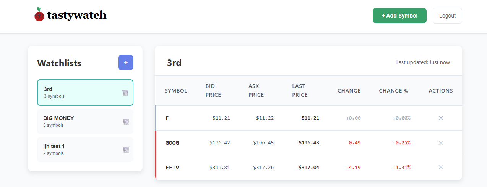

# Tasty Watch - Stock Watchlist Application

A modern, real-time stock watchlist application built with **Svelte** and the **Tastytrade API**. Track your favorite stocks with live market data, manage multiple watchlists, and view detailed price charts.



## 🚀 Features

### Core Features
- **🔐 Secure Authentication** - Session token-based authentication with Tastytrade API
- **📋 Watchlist Management** - Create, edit, and delete multiple watchlists
- **📈 Real-time Quotes** - Live market data with 5-second refresh intervals
- **🔍 Symbol Search** - Autocomplete symbol search with company name matching
- **📱 Responsive Design** - Mobile-first design that works on all devices

### Bonus Features ⭐
- **📊 Price Charts** - Interactive 24-hour candlestick charts with TradingView's Lightweight Charts
- **♿ Accessibility** - WCAG 2.1 AA compliant with full keyboard navigation and screen reader support

## 🛠️ Tech Stack

- **Frontend**: Svelte 5 + SvelteKit
- **Build Tool**: Vite
- **Language**: TypeScript
- **Styling**: Modern CSS with Flexbox/Grid
- **Charts**: Lightweight Charts by TradingView
- **API**: Tastytrade REST API with SvelteKit proxy layer
- **Accessibility**: WAI-ARIA compliant

## 📋 Prerequisites

Before you begin, ensure you have:

1. **Node.js** (version 18 or higher)
2. **npm** (comes with Node.js)
3. **Tastytrade Sandbox Account** - Sign up at [developer.tastytrade.com](https://developer.tastytrade.com)

## ⚡ Quick Start

### 1. Clone the Repository

```bash
git clone <repository-url>
cd tasty-watch
```

### 2. Install Dependencies

```bash
npm install
```

### 3. Setup Environment Variables (Optional)

Copy the example environment file and customize if needed:

```bash
cp .env.local.example .env.local
```

The default configuration works with Tastytrade's sandbox environment. Only modify if you need custom API endpoints.

### 4. Start Development Server

```bash
npm run dev
```

The application will be available at `http://localhost:5173`

### 5. Login with Tastytrade Credentials

Use your Tastytrade sandbox account credentials to log in and start tracking stocks!

## 🏗️ Development

### Available Scripts

```bash
# Start development server with hot reload
npm run dev

# Build for production
npm run build

# Preview production build
npm run preview

# Type check the project
npm run check

# Type check in watch mode
npm run check:watch
```

### Project Structure

```
src/
├── lib/
│   ├── components/          # Reusable UI components
│   │   ├── auth/           # Authentication forms
│   │   ├── watchlist/      # Watchlist table and controls
│   │   ├── symbols/        # Symbol search and details
│   │   └── ui/             # Generic UI components
│   ├── services/           # Client-side services
│   │   └── api.ts          # HTTP client for internal API routes
│   ├── stores/             # Svelte stores for state management
│   │   ├── auth.ts         # Session state management
│   │   ├── watchlists.ts   # Watchlist data
│   │   └── quotes.ts       # Real-time quote data
│   └── utils/              # Utility functions
│       └── formatters.ts   # Price/number formatting
├── routes/                 # SvelteKit routes and pages
│   ├── api/               # Server-side API routes (proxy to Tastytrade)
│   │   ├── auth/          # Authentication endpoints
│   │   ├── watchlists/    # Watchlist CRUD operations
│   │   ├── market-data/   # Market data endpoints
│   │   └── symbols/       # Symbol search endpoints
│   └── +page.svelte       # Main application page
└── app.html               # HTML template
```

## 🔧 Configuration

### Environment Variables

```bash
# .env.local
VITE_TASTYTRADE_API_URL=https://api.cert.tastyworks.com
```

**Note**: The default configuration works with Tastytrade's sandbox environment. Most users won't need to modify these values.

## 📊 API Integration

### API Architecture

The application uses a **proxy pattern** with SvelteKit API routes:
- Client calls internal API routes (`/api/*`)
- API routes proxy requests to Tastytrade API
- Handles authentication and error management server-side

### Internal API Routes
- **Auth**: `POST /api/auth` - Exchange credentials for session token
- **Watchlists**: `GET/POST/PUT/DELETE /api/watchlists` - CRUD operations
- **Symbol Search**: `GET /api/symbols/search/{query}` - Autocomplete search
- **Market Data**: `GET /api/market-data/{symbol}` - Quote snapshots

### Rate Limiting & Performance

- **Quote Polling**: 5-second intervals for quote updates
- **Search Debouncing**: 300ms delay for symbol search to reduce API calls
- **Error Handling**: Exponential backoff for failed requests

## ♿ Accessibility Features

- **Semantic HTML** with proper heading hierarchy
- **ARIA labels** for dynamic content and interactive elements
- **Keyboard Navigation** - Full functionality without mouse
- **Screen Reader Support** - Announcements for quote updates and state changes
- **High Contrast** - Color combinations meet WCAG AA standards
- **Focus Management** - Clear focus indicators and logical tab order

### Keyboard Shortcuts

- **Tab/Shift+Tab** - Navigate between interactive elements
- **Enter/Space** - Activate buttons and links
- **Escape** - Close modal dialogs and overlays
- **Arrow Keys** - Navigate search results and symbol lists

## 🚀 Deployment

### Build for Production

```bash
npm run build
```

The built application will be in the `dist/` directory.

### Deployment Considerations

- **CORS Headers** - Ensure proper CORS configuration for API calls
- **CDN** - Consider using a CDN for static assets
- **Environment Variables** - Update API URLs for production environment
- **Rate Limits** - Monitor API rate limits in production environment

### Recommended Platforms

- **Vercel** - Zero-config deployment for SvelteKit
- **Netlify** - Simple static site hosting
- **AWS Amplify** - Full-stack deployment with CI/CD

## 🔍 Testing

The application includes comprehensive error handling and fallback mechanisms:

- **Network Resilience** - Handles network errors with exponential backoff
- **Session Management** - Automatic re-authentication for expired sessions
- **Loading States** - Clear feedback for all async operations

## 🐛 Troubleshooting

### Common Issues

**Login Issues**
- Verify Tastytrade sandbox credentials
- Check network connectivity
- Ensure API endpoints are accessible

**Chart Display Issues**
- Ensure sufficient container width for chart rendering
- Check browser console for JavaScript errors
- Verify lightweight-charts library is properly loaded

### Getting Help

1. Check the browser console for error messages
2. Verify network connectivity and API responses
3. Review the CLAUDE.md file for development guidance
4. Check Tastytrade API documentation for endpoint changes

## 📄 License

This project is created for educational and demonstration purposes. Please comply with Tastytrade's API terms of service.

## 🙏 Acknowledgments

- **Tastytrade** - For providing the comprehensive trading API
- **TradingView** - For the excellent Lightweight Charts library
- **Svelte Team** - For the amazing framework and tooling
- **The Open Source Community** - For the countless libraries that made this possible

---

**Built with ❤️ using Svelte and the Tastytrade API**
